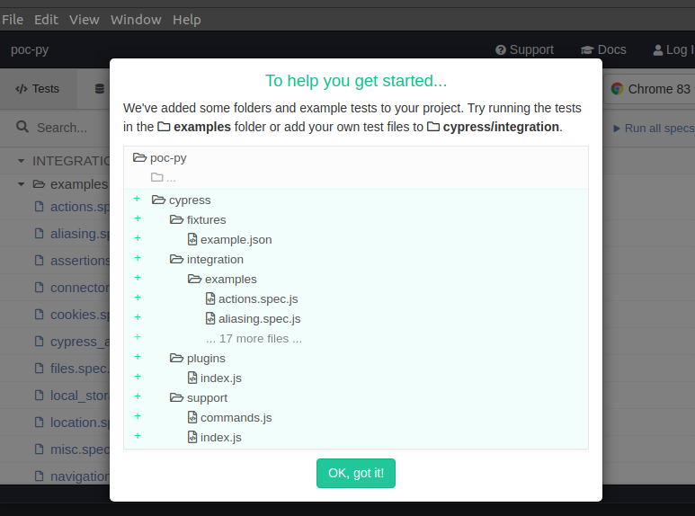

En los últimos tiempos cuando hablamos de tests E2E en aplicaciones web, no podemos dejar de hablar de [Cypress](https://www.cypress.io/) que se está convirtiendo en el estándar de facto, sustituyendo a Selenium en muchos proyectos a nivel empresarial.

Las razón principal de este éxito es que gracias a esta tecnología este tipo de pruebas han vuelto a recobrar la confianza que perdieron con Selenium; y esto es porque Cypress aporta el punto de robustez y confianza que no puede aportar Selenium.

# Instalación y configuración inicial

Cypress está muy ligado al mundo NodeJS por lo que primero nececitamos tener instalado un runtime de NodeJS en nuestra máquina de desarrollo. La mejor forma de instalar NodeJS es través de [NVM](https://github.com/nvm-sh/nvm).

Una vez tenemos NodeJS y si queremos crear un proyecto exclusivamente con Cypress sin integrarlo con otro proyecto web, lo que tenemos que hacer es crear una carpeta e inicializar el proyecto con estos comandos:

```bash
$> mkdir poc-cy
$> cd poc-cy
$> npm init
```

La inicialización nos hará una serie de preguntas como el nombre del proyecto y finalizará creando el fichero package.json en la raíz del proyecto.

Es el momento de instalar la dependencia de Cypress en nuestro proyecto para ello ejecutamos:

```bash
$> npm install --save-dev cypress
```

Esto dispara un proceso de instalación de la herramienta en nuestro proyecto. Vamos a editar la sección de scripts de nuestro fichero package.json para configurar el arranque de los comandos principales de cypress, quedando el fichero package.json de nuestro de proyecto de esta forma:

```javascript
{
  "name": "poc-cy",
  "version": "1.0.0",
  "description": "",
  "main": "index.js",
  "scripts": {
    "open": "cypress open",
    "test": "cypress run"
  },
  "author": "",
  "license": "ISC",
  "devDependencies": {
    "cypress": "^4.8.0"
  }
}
```

El siguiente paso es abrir la herramienta desde nuestro proyecto, para ello ejecutamos el siguiente comando:

```bash
$> npm run open
```

Este comando nos abre una ventana donde indica que se han creado una estructura de directorios para gestionar los tests que se implementen con Cypress en el proyecto.



Si pinchamos en "Ok, got it", podemos ver que aparece un árbol con un nodo "examples" y un montón de archivos de ejemplo listos para ejecutar simplemente pinchando sobre ellos.

En la derecha tenemos la posibilidad de elegir donde queremos ejecutar los tests: Chrome, Firefox o Electron y justo debajo un botón "Run all specs" para ejecutar todos los tests implementados en bateria sobre la ventana en la que estás interactuando.


Si es la primera vez que estás con este tipo de tecnologías, pulsa sobre el botón "Run all specs" y déjate sorprender. ;-)

# Ejecución de los tests en el terminal

Otra de las fortalezas de Cypress es que los tests se pueden ejecutar desde el terminal, lo que favorece su inclusión en procesos de integración contínua. 

En nuestro caso, simplemente tenemos que ejecutar el comando:

```bash
$> npm run test
```

Verás que es este caso el navegador es Electron y esto es una ventaja ya que no tenemos que configurar nada extra en el pipeline de integración para poder ejecutar estos test en máquina que no tienen interfaz gráfica.

Otro detalle que podrás comprobar es que se está almacenando un vídeo con la ejecución del tests (esto se puede configurar si no se quiere) y podemos obtener un reporte pon consola como el que se muestra en la imagen:


# Creación de nuestro primer test

Ahora abrimos nuestro proyecto con nuestro editor favorito, el mío es Visual Studio Code y lo primero que suele hacer es mover la carpeta "examples" un nivel hacía arriba para sacarlos del flujo de ejecución pero seguir teniéndoles como referencia.

Hecho esto dentro de la carpeta "integrations" creamos el fichero first.spec.js con el siguiente contenido:

```javascript
/// <reference types="Cypress" />

it('simple', () => {
    cy.visit('https://www.google.es');
})
```

> A fin de poder tener autocompletado de las operaciones del objeto cy necesitamos incluir la primera línea de reference

Este test lo único que queremos hacer es visitar la página de Google, ahora para ejecutar el test nos vamos a apoyar en la herramienta visual.

```bash
$> npm run open
```

Vemos que la herramienta se abre y que solo aparece nuestro test, pinchamos sobre él y vemos que se abre una instancia de Chrome que ejecuta el tests y nos deja alojados en la página de Google.


El test va a consistir en simular el comportamiento de un usuari@ que vaya a realizar una búsqueda de la palabra Cypress en el buscador de Google. Por tanto, tenemos que simular que llegamos a la página de Google, escribimos sobre el campo de texto y pulsamos sobre la opción "Cypress" para mostrar los resultados de la búsqueda.

Pero, ¿cómo hacemos esto? ¿cómo sabemos con qué elementos del DOM tenemos que interacturar? ¿tenemos que mirar todo el código fuente? La respuesta a estas preguntas las da la propia herramienta de Cypress pinchando sobre el icono que hay a la izquierda la barra de navegación


Al pinchar sobre él se abre una barra de herramientas que nos permite identificar los elementos (1) de la página simplemente situándonos encima de ellos, y desde el botón de copy (2) ya nos da el comando que tenemos que utilizar en el tests para poder interacturar con ese elemento.


Con esta herramienta podemos localizar los elementos en la página. En nuestro caso el campo de texto y el botón de "Buscar en Google" e interactuar con ellos desde el test con este código:

```javascript
/// <reference types="Cypress" />

it('simple', () => {
    cy.visit('https://www.google.es');
    cy.get('.gLFyf').type('Cypress');
    cy.get(':nth-child(2) > .jKWzZXdEJWi__suggestions-inner-container > .sbtc > .sbl1 > span').click();
})
```

Como puedes comprobar cada vez que guardamos, el test se vuelve a ejecutar de forma automática.

