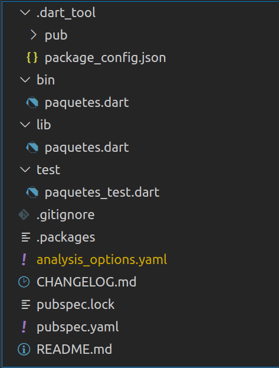

# Resumen

En este artículo vas a encontrar una guía práctica sobre Dart orientada a su uso en aplicaciones flutter.

# Entorno

* Slimbook Prox15 32 Gb RAM i7 
* SlimbookOS (Ubuntu 20.04)
* Dart 2.8.4
* Visual Studio Code

# Instalación en Ubuntu 20.04 y Hola mundo

Para la instalación de Dart en Ubuntu 20.04 tenemos que seguir los siguientes pasos:

```bash
$> sudo apt-get update
$> sudo apt-get install apt-transport-https
$> sudo sh -c 'wget -qO- https://dl-ssl.google.com/linux/linux_signing_key.pub | apt-key add -'
$> sudo sh -c 'wget -qO- https://storage.googleapis.com/download.dartlang.org/linux/debian/dart_stable.list > /etc/apt/sources.list.d/dart_stable.list'
$> sudo apt-get update
$> sudo apt-get install dart
$> dart --version
```

Lo primero que tenemos que hacer cuando empezamos en cualquier lenguaje es conseguir el Hola Mundo!. Para el caso de Dart vamos a crear el fichero holamundo.dart con el siguiente contenido:

```dart
main(List<String> args) {
  print('Hola Mundo! ' + args[0]);
}
```
Y para ejecutarlo vamos a abrir el terminal y ejecutar:

```bash
$> dart holamundo.dart Dart
```

De forma que por consola tenemos que ver el texto "Hola Mundo! Dart" siendo la garantía de que todo está correctamente instalado y configurado.

# Creación de un proyecto completo

La creación del proyecto inicial se puede hacer desde Visual Studio Code con la opción "Dart: New Project" (siempre que se tenga instalada la extensión de Dart para este IDE).

Al seleccionar esta opción, el asistente nos dará a elegir entre las siguiente opciones:
* **AngularDart Web App**: A web app with material design components.
* **Bare-bones Web App**: A web app thah uses only core Dart libraries.
* **Console Application**: A command-line application sample.
* **Dart Package**: A starting point for Dart libraries or applications.
* **Simple Console Application**: A simple command-line application.
* **StageXL Web App**: A starting point for 2D animation and games.
* **Web Server**: A web server build using the shelf package.

Una vez seleccionado, nos pedirá donde queremos crear los archivos, en caso de crear un proyecto con la opción "Console Application" nos creará una estructura de directorios parecida a esta:



# Depuración de programas

Con la extensión de Visual Studio Code propuesta anteriormente la compatibilidad con el Debug es total, por lo que solo vamos a tener que pulsar en F5 para activar el modo de debug y que la ejecución se pare en cualquier punto de ruptura que hayamos puesto en el código.

Tenemos que tener un archivo .vscode/launch.json con el siguiente contenido:

```js
{
    "version": "0.2.0",
    "configurations": [
        {
            "name": "Dart",
            "program": "bin/main.dart",
            "request": "launch",
            "type": "dart"
        }
    ]
}
```

# Tipos de datos

Dart es un lenguaje de tipado estricto por lo que permite definir las variables de un tipo especifico, haciendo que el IDE nos pueda ayudar a gestionarlas mejor.

## Números

En Dart podemos declarar variables de tipo int y de tipo double.

```dart
int a = 11;
double b = 18.9;
```

Cuando no se le da valor simplemente toma el valor null por defecto.

## Strings

Las variables de tipo string se pueden declarar con comillas simples o con comillas dobles, siendo preferible la comilla simple.

```dart
String cad = 'Hola Mundo';
```

También es posible definir String en multilínea con la siguiente sintaxis:

```dart
String multilinea = '''
  Esto es una cadena
  multilínea
'''
```

## Booleans

Una variable también podemos definir la tipo boolean de esta forma:

```dart
bool loading = true
bool loading = false
```

Hay que tener en cuenta que las variables de tipo bool que no se inicializan tienen el valor null.

## Listas

También podemos definir variables de tipo lista de valores que definimos de las siguientes formas:

```dart
List<String> colores = ['Red', 'Blue'];

List<String> colores = new List();
colores.add('Red');
colores.add('Blue');
colores.addall(['Orange', 'Purple']);

```

En caso de declarar la lista con final:

```dart
final List<String> colores = ['Red', 'Blue'];
```

Podemos seguir agregando valores con el método add y addAll, pero no podemos asignarle una nueva lista de valores a la misma variable.

Si se define como const de cualquiera de estas formas:

```dart
const List<String> colores = ['Red', 'Blue'];
List<String> colores = const['Red', 'Blue'];
```

Al utilizar el método add o addAll vamos a recibir un error en tiempo de ejecución indicando que la lista no puede ser modificada.

## Sets

La diferencia con las listas es que no admite valores duplicados y los valores se establecen con {}. De forma que podemos declarar un Set de Strings de esta forma:

```dart
Set<String> colores = {'Red', 'Blue'};
colores.add('Blue');
```

Pero si añado un elemento que ya existe a este conjunto, simplemente lo ignora sin dar error.

## Maps

También podemos definir el tipo de dato Map que no es más que una estructura de datos que almacena la información ordenada en clave - valor.

```dart
Map<String, String> colores = {
    'RED': 'red',
    'BLUE': 'blue'
}
```

En caso de querer acceder al primer valor lo podríamos hacer con la síntaxis:

```dart
print(colores['RED']);
```

También podemos definir un mapa que contenga cualquier tipo de valor, lo que se conoce en dart como "dynamic".

```dart
Map<String, dynamic> cajon = new Map();
cajon.addAll({'RED': 'red', 'BLUE': 'blue', 'YELLOW': 190});
```

# Comentarios

Los comentarios de una sola línea se hace con // y los comentarios de multilinea con /* */

Podemos hacer uso de dartDoc para añadir documentación a nuestras funciones:

```dart
/**
* Esta función no hace nada
* [arg1] Argumento 1
* [arg2] Argumento 2
*/
void noop(Strign arg1, String arg2) {}
```

# Operadores aritméticos

En Dart se pueden utilizar los operadores aritméticos para realizar operaciones básicas como:

```dart
int a = 10 + 5       //  15
int b = 20 - 10      //  10
int c = 10 * 2       //  20
double d = 10 / 2    // 5

double e = 10.0 % 3  // Devuelve el módulo, el sobrante de la división
double f = 10.0 ~/ 3 // Devuelve la parte entera de la división.
f = -f               // Cambia el signo de la variable
```

# Operadores de asignación

En Dart se utiliza el = para asignar valor a una variable, como ocurre en muchos otros lenguajes. Lo realmente característico de Dart es la forma de darle valor a una variable solo en el caso de que se null, de esta forma:

```dart
int a;

a ??= 11;
```
El resultado será 11, pero si hacemos lo siguiente:

```dart
int a;

a = 3;

a ??= 11;
```

Entonces el resultado será 3.

# Operadores condicionales

Podemos utilizar el ?? para asignar valor en función de una condición, por ejemplo:

```dart
int a = b ?? c ?? d ?? 11;
```

En caso de que b, c y d sean nulos, entonces el valor de a será 11. Si alguno de los anteriores no es nulo, a tomará el valor del primero de ellos de izquierda a derecha.


# Operadores relacionales

Son los operadores que retornas valores booleanos, nunca devuelven null, nos permiten evaluar ciertas condiciones. En Dart tenemos:

* \>    -- Mayor que
* <     -- Menor que
* \>=   -- Mayor o igual que
* <=    -- Menor o igual que
* ==    -- Igual
* !=    -- Distintos
* is    -- Para saber si es de un tipo
* is!   -- Para saber que no es de un tipo

# Control de flujo

## If else

En Dart tenemos la posibilidad de hacer un if else con la siguiente sintaxis:

```dart
if (edad < 18) {
    print('No tienes la edad suficiente');
} else {
    print('Edad valida');
}
```

## Switch

Para el caso donde tengamos que anidar varios if else nos puede ser útil el switch, que tiene la siguiente sintaxis:

```dart
switch ( value ) {

    case case1:
      print('case1');
      break;

    case case2:
      print('case2');
      break;

    default:
     print('default');

}
```

## For

El bucle for nos sirve para recorrer colecciones, podemos hacerlo con un índice:

```dart
const List<String> colores = ['Red', 'Blue'];
for (int i = 0; i < colores.length; i++) {
    print(colores[i]);
}
```

O podemos hacerlo con la sintaxis for..in:

```dart
const List<String> colores = ['Red', 'Blue'];
for (String color in colores) {
    print(color);
}
```

También podemos hacer uso de "continue" para saltar un elemento de la colección o "break" para salir prematuramente del bucle.

## While

El while es un bucle que se puede ejecutar de 0 a n veces, dependiendo de la condición. La sintaxis sería:

```dart
while (cond) {
    // algo
}
```

## Do while

El do while es un bucle que se puede ejecutar de 1 a n veces, dependiendo de la condición. La sintaxis sería:

```dart
do {
    // algo
} while (cond);
```

# Funciones

Las funciones en Dart como en cualquier otro lenguaje nos permiten agrupar código que vamos a llamar más de una vez. Para un caso donde tengo una función que recibe un String obligatorio, un String opcional y devuelve un String está sería la sintaxis:

```dart
String noop(String arg, [String arg2 = 'default']){
    //algo
    return 'algo';
}
```

En caso de querer que los argumentos fueran por nombre simplemente los englobo en {} llamando a la función pasando los nombres, de esta forma:

```dart
String noop({String arg, String arg2}){
    //algo
    return 'algo';
}
noop(arg: 'value', arg2: 'value2');
```

Los argumentos primitivos siempre se pasan por valor, es decir, no pueden ser modificados; mientras que las colecciones se pasan por referencia, de forma que cuando se modifican los valores se está haciendo de forma global.

Para evitar está situación en el paso por referencia se recomienda hacer una copia del objeto con la sintaxis:

```dart
collection = { ... collection }
```
Las funciones se pueden simplificar con la notación fecha => , como en este ejemplo:

```dart
int sumar(int a, int b) {
    return a + b;
}

int sumar(int a, int b) => a + b;
```

También se utiliza mucho esta notación para añadir las funciones que requieren algunos iterables como el de este ejemplo:

```dart
List<int> listado = [1,2,3,4,5,6];
List<int> newList = listado.where((n) => n > 2);
```

En Dart también tenemos el concepto de callback, que no es más que una función que se llama dentro de otra función. Este sería un ejemplo de utilización.

```dart
main() {
    obtenerPersona('1', (Map persona) {
        print(persona);
    })
}

void obtenerPersona(String id, Function callback) {

    Map persona = {
        'id': '1',
        'nombre': 'Mateo'
    }

    callback(persona);

}
```

# Otros tipos de datos

## Queue

en Dart tenemos el tipo de colección Queue que nos permite mantener la colección en  una estructura de datos de cola que se puede iterar con un Iterator de Dart de la siguiente forma:

```dart
import 'dart:collection';

main() {
    Queue<int> cola = new Queue();
    cola.addAll([10,20,30,40,50]);

    Iterator i = cola.iterator;
    while(i.moveNext) {
        print(i.current);
    }
}

```
## Enumeraciones

En Dart también podemos definir enumeraciones para darle mayor significado y semántica a ciertos valores constantes de la aplicación. Este sería un ejemplo de utilización:

```dart
void main() {

    Audio volumen = Audio.bajo;

    switch(volumen) {

        case Audio.bajo : print('Volumen bajo'); break;
        case Audio.medio : print('Volumen medio'); break;
        case Audio.alto : print('Volumen alto'); break;
    }

}

enum Audio {
    bajo, 
    medio, 
    alto
}
```

## Future

Es el tipo de dato de Dart que se define para las tareas asíncronas, se podría asemejar a Promise de JavaScript. Este sería un ejemplo de uso:

```dart
void main() {

    Future<String> timeout = Future.delayed(Duration(seconds: 2), () {
      print('Después de 2 segundos');
      return 'Cadena que devuelve el future';
    });

    timeout.then(print).catchError(print);

    print('Fin método main');

}
```

La salida de esta ejecución sería:

```
Fin método main
Después de 2 segundos
Cadena que devuelve el future
```

Como en el caso de las promesas también podemos hacer uso de async / await con Future:

```dart
void main() async {

    Future<String> timeout = Future.delayed(Duration(seconds: 2), () {
      print('Después de 2 segundos');
      return 'Cadena que devuelve el future';
    });

    String resultado = await timeout;
    print(resultado);

    print('Fin método main');

}
```
Pero hay que hacer notar que ahora la salida difiere del tratamiento anterior sin async/await en que el código se vuelve más secuencial y también más fácil de entender y mantener.

```
Después de 2 segundos
Cadena que devuelve el future
Fin método main
```
En caso de producirse un error podemos capturarlo con un bloque try / catch de esta forma:

```dart
void main() async {
  Future<String> timeout = Future.delayed(Duration(seconds: 2), () {
    print('Después de 2 segundos');
    if (1 == 1) throw 'Error';
    return 'Cadena que devuelve el future';
  });

  try {
    String resultado = await timeout;
    print(resultado);
  } catch (err) {
    print(err);
  }

  print('Fin método main');
}
```

## Streams

Los Streams en Dart son muy parecidos a los Observables de RxJS y representan un flujo de información. Este sería un ejemplo sencillo:

```dart
import 'dart:async';

void main() async {
  final streamController = new StreamController<String>.broadcast();

  streamController.stream.listen(
      (event) => print(event),
      onError: (err) => print(err),
      onDone: () => print('Fin del stream'),
      cancelOnError: false
  );


  streamController.sink.add('info');
  streamController.sink.addError('Error info 2');
  streamController.sink.add('info 3');

  streamController.sink.close();

  print('Fin método main');
}
```

> El broadcast es para permitir más de un listen, sin establecerlo, al conectar un segundo listen tendríamos un error.

Es importante resaltar que para hacer uso de los Streams tenemos que importar el paquete 'async' de Dart; el cual nos permite definir un stream con la clase StreamController, donde con el método listen (lo que es el subscribe en RxJS) podemos definir que se tiene que hacer con la información que fuya en ese stream y con el método sink.add podemos inyectar información válida en el stream, y con sink.addError podemos inyectar un error en el stream el cual será gestionado por el bloque onError, de modo que cuando ejecutemos este código esta será la salida:

```
Fin método main
info
Error info 2
```
Como se ve el último mensaje "info 3" y el OnDone no se muestra, si queremos que se muestren tendremos que establecer la propiedad "cancelOnError" a false en el listen del stream, de forma que ahora la salida sería:

```
Fin método main
info
Error info 2
info 3
Fin del stream
```

## Clases

En Dart también existe el concepto de clase, que nos permite modelar las distintas entidades de mi aplicación en atributos, métodos y constructores y ser utilizado para la definición de un tipo de dato.

Este es un ejemplo de creación de una clase básica, quizá lo más novedoso de Dart es que nos permite tener constructores por nombre como ocurre con Persona.withName.

```dart
class Persona {
  String _nombre;
  String _apellidos;

  String get nombre => _nombre;
  String get apellidos => _apellidos;

  set nombre(String nombre) => _nombre = nombre;
  set apellidos(String apellidos) => _apellidos = apellidos;

  Persona(this._nombre, this._apellidos);

  Persona.withName(this._nombre);
  
  @override
  String toString() => '$_nombre $_apellidos';
}
``` 


Existe también una forma de crear las clases para que sean inmutables y siempre que todos los valores de los atributos sean iguales, no se creen más instancias en memoria.

```dart
class Persona {
  final String _nombre;
  final String _apellidos;

  String get nombre => _nombre;
  String get apellidos => _apellidos;


  const Persona(this._nombre, this._apellidos);
  
  @override
  String toString() => '$_nombre $_apellidos';
}
```

Pero es importante que cuando se instancien los objetos se haga con la palabra reservada "const", de esta forma pintaremos true por consola:

```dart
Persona p = const Persona('Ruben', 'Aguilera');
Persona p2 = const Persona('Ruben', 'Aguilera');

print(p == p2);
```
En Dart también contamos con los constructores facotry que devuelven una instancia de la clase en base al resultado de cierta lógica que debe devolver la instancia a partir de un constructor con nombre, nunca del constructor por defecto ya que se crea un bucle infinito.

```dart
class Persona {
  String _nombre = '';
  String _apellidos = '';

  String get nombre => _nombre;
  String get apellidos => _apellidos;


  factory Persona(String nombre, String apellidos) {
    if (nombre != apellidos) {
      return Persona.distinta(nombre, apellidos);
    }else {
      return Persona.igual(nombre, apellidos);
    }
  }

  Persona.distinta(String nombre, String apellidos) {
    this._nombre = 'distinta';
    this._apellidos = 'dintinta';
  }

  Persona.igual(String nombre, String apellidos) {
    this._nombre = 'igual';
    this._apellidos = 'igual';
  }
  
  @override
  String toString() => '$_nombre $_apellidos';
}

```
En las clases de Dart también podemos definir propiedades y métodos estáticos que pertenezcan a la clase y no la instancia de la misma. Para definir una propiedad estática, me interesa utilizar el modificador const junto con static a fin de hacer que sea solo de lectura; y de igual forma se crean los métodos estáticos para ser llamados sin hacer el new de la clase, hay que tener en cuenta que estos métodos o manejan elementos estáticos o son funciones puras que no requieren de atributos de las clases. Por ejemplo:

```dart
class Paleta {

    static const List<String> colores = ['Red', 'Blue', 'Orange', 'Purple'];

    static void mostrarColores() => colores.forEach((print));

}
```

Y sería llamado de esta forma, mostrando los colores establecidos en la lista.

```dart
Paleta.mostrarColores();
```

## Patrón singleton

Para implementar el patrón Singleton con Dart tenemos que hacer:

```dart
class EjemploSingleton {

    static final EjemploSingleton _singleton = new EjemploSingleton._internal();

    factory EjemploSingleton {
      return _singleton;
    }

    EjemploSingleton._internal();

    String prop = 'Propiedad 1';

}
```

De esta forma cuando se modifique el valor de prop se hará para toda la aplicación al tener una única instancia.

Como en todo lenguaje orientado a objetos en Dart tenemos clases y la posibilidad de herencia, utilizando la palabra reservada "extends".

```dart
abstract class Animal {

    String nombre;
    String tipo;

    Animal(this.nombre, this.tipo);

    imprimirInfo() => print('''
    $nombre 
    $tipo
    ${this.calculoTiempoVida().toString()}''');

    double calculoTiempoVida();
}

class Gato extends Animal {

    Gato(String nombre) : super(nombre, 'Gato');

    @override
    imprimirInfo() => print(super.imprimirInfo() );

  @override
  double calculoTiempoVida() {
    return 7.0;
  }

}
```

## Mixins

Este es un concepto propio de Dart que hace que los métodos de las clases anotadas con la palabra reservada "mixin" puedan ser utilizados por cualquier otra clase que las quiera utilizar con la palabra reservada "with".

Una clase anotada con "mixin" tiene las siguientes restricciones:
* No pueden ser instanciados.
* No puede tener constructor.
* No puede ser utilizada con "extends"

Este sería un ejemplo:

```dart
mixin Logger {

  void imprimirLog(String texto) {
    final fecha = DateTime.now();
    print('$fecha ----- $texto');
  }

}

class Gato with Logger {

  Gato() {
    imprimirLog('He creado un Gato');
  }

}
```

# Uso de Http

Para poder conectar con servicios remotos a través de Http, necesitamos immportar el paquete http, que como cualquier paquete de Dart lo podemos encontrar en el repositorio oficial [https://pub.dev](https://pub.dev), una vez localizado lo damos de alta en la sección "dev_dependencies" de nuestro fichero "pubspec.yaml"

```dart
name: paquetes
description: A sample command-line application.
# version: 1.0.0
# homepage: https://www.example.com

environment:
  sdk: '>=2.8.1 <3.0.0'

#dependencies:
#  path: ^1.7.0

dev_dependencies:
  pedantic: ^1.9.0
  test: ^1.14.4
  http: 0.12.2
```

y al guardar tenemos que observar que se dispara el proceso pub get de forma automática.

Ahora en el fichero main.dart o donde lo vayamos a utilizar vamos a declarar el paquete http y hacer una petición get, de esta forma:

```dart
import 'package:http/http.dart' as http;

void main(List<String> arguments) {
  final url = 'https://api.github.com/users';
  http.get(url).then((res) => print(res.body));
}
```


# Recetas

## Permitir introducir información por consola

Lo tenemos que hacer con la librería "dart:io" de esta forma:

```dart
import 'dart:io';

main(List<String> args) {

  stdout.writeln('Introduce la edad');

  int edad = int.parse(stdin.readLineSync());

  stdout.writeln('Has introducido $edad');

}
```