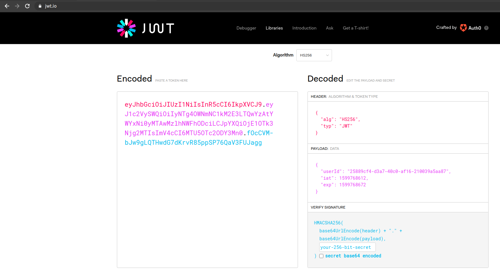

# Resumen

Vamos a ver cómo configurar la autenticación para hacer necesario tener un token JWT válido en el acceso a nuestros endpoints más sensibles.

# Entorno

- Slimbook Prox15 32 Gb RAM i7
- SlimbookOS (Ubuntu 20.04)
- NestJS 7.0.0
- Visual Studio Code

# Introducción

La autenticación con token de JWT se ha convertido en un estándar de facto a la hora de proteger los endpoints más sensibles de nuestra aplicación: aquellos que crean, modifican o eliminan recursos de nuestro servidor y otros de consulta que devuelven información sensible que solo debería estar accesible por el usuario en concreto.

De hecho aquí vamos a ver como enviar el id del usuario a través de token, algo mucho más seguro que hacerlo por parámetro en la URL. Imaginad un endpoint que devuelve datos judiciales, y que simplemente cambiando el id por parámetro y volviendo hacer la llamada, devuelve los datos judiciales, que obviamente tienen que ser confidenciales, de cualquier persona que no conoces de nada, pues eso ha pasado....

# Vamos al lío

En NodeJS se suele utilizar Passport para la configuración de los métodos de autenticación, por lo que NestJS ya nos ofrece una integración directa con esta librería, simplemente instalando las siguientes dependencias.

```bash
$> npm install --save @nestjs/passport passport @nestjs/jwt passport-jwt bcrypt
$> npm install --save-dev @types/passport-jwt @types/bcrypt
```

Además de Passport también instalamos la dependencia de bcrypt que nos va a permitir codificar la password en base de datos, para que nadie, incluso personas con permisos para ver las tablas de credenciales de usuario pueda conocer tu contraseña.

Siguiendo con la serie de tutoriales tenemos ya en nuestro proyecto un fichero src/users/user.entity.ts que define nuestra entidad de usuario y que vamos a utilizar para asociarle la password que usaremos para comprobar la entidad de la persona en el proceso de login.

Por ello necesitamos añadir la columna password, y dos métodos: uno que se va a ejecutar antes del insert de la entidad y que se va a encargar de codificar la password y otro que usaremos posteriormente para validar que la password del usuario al hacer login es válida, gracias a la librería bcrypt.

La entidad UserEntity quedaría de esta forma:

```ts
import * as bcrypt from 'bcrypt';
import { BeforeInsert, Column, Entity, PrimaryGeneratedColumn } from 'typeorm';

@Entity('users')
export class UserEntity {
  @PrimaryGeneratedColumn('uuid')
  readonly userId: string;

  @Column({
    unique: true,
  })
  readonly name: string;

  @Column({ type: 'varchar', length: 70, nullable: true })
  password: string;

  @BeforeInsert()
  async hashPassword() {
    const salt = await bcrypt.genSalt();
    this.password = await bcrypt.hash(this.password, salt);
  }

  async validatePassword(password: string): Promise<boolean> {
    return await bcrypt.compareSync(password, this.password);
  }

  constructor(userId: string, name: string, pass: string) {
    this.userId = userId;
    this.name = name;
    this.password = pass;
  }
}
```

De la serie de tutoriales ya sabrás que estamos usando migrations de TypeORM, así que este es el momento de generar un nuevo fichero de migración ejecutando el comando:

```bash
$> npm run typeorm:migrate add-auth
```

Ahora vamos al servicio UsersRepository para añadir un nuevo método que me permita recuperar un usuario a partir de su nombre.

```ts
getUserByName(name: string): Promise<UserEntity> {
    return this.usersRepository.findOne({ name });
}
```

Este método va a ser invocado por la capa de servicio, por lo que dentro del servicio UsersService vamos a crear un nuevo método que haga la llamada al repositorio.

```ts
async getUserByName(name: string): Promise<UserEntity> {
    return await this.usersRepository.getUserByName(name);
}
```

Este es un buen momento para ver que todo es correcto, que la migración se aplica correctamente y que todos nuestros tests siguen pasando, así que ejecutamos:

```bash
$> npm run verify
```

Tendremos que ver que todo sigue siendo correcto, aunque ahora tenemos la cobertura un poco más baja al tener nuevo código que no ha sido todavía probado.

Una vez tenemos todo lo necesario para guardar las credenciales de nuestros usuarios, es el momento de crear un nuevo módulo llamado "auth":

```bash
$> npx nest generate module auth
```

Dentro del nuevo módulo vamos a crear el fichero auth.service, el cual va a implementar dos métodos: uno "validateUser" que se va a encargar de validar las credenciales del usuario, es decir, que el username exista en la base de datos y que su password coincida con el rebibido en en el endpoint de login; y otro método "generateAccessToken" que se va encargar de generar el accessToken con la información que queramos guardar en el payload del token JWT, para nuestro caso de uso, hacemos una consulta a la base de datos, para recuperar el id del usuario y guardarlo en el payload del token JWT, que recordemos va en claro, por lo que no hay que almacenar información sensible como dni, números de cuenta, contraseñas, etc...

```ts
import { Injectable } from '@nestjs/common';
import { JwtService } from '@nestjs/jwt';
import { UsersService } from 'src/users/users.service';
import { JWTPayload } from './jwt.payload';

@Injectable()
export class AuthService {
  constructor(
    private usersService: UsersService,
    private jwtService: JwtService
  ) {}

  async validateUser(username: string, pass: string): Promise<boolean> {
    const user = await this.usersService.getUserByName(username);
    return await user.validatePassword(pass);
  }

  async generateAccessToken(name: string) {
    const user = await this.usersService.getUserByName(name);
    const payload: JWTPayload = { userId: user.userId };
    return {
      access_token: this.jwtService.sign(payload),
    };
  }
}
```

Cuando trabajas con TypeScript es buena práctica crear interfaces / clases que guarden el tipado de los objetos que utilizamos. En este caso, vamos a crear el fichero auth/jwt.payload.ts con el siguiente contenido:

```ts
export interface JWTPayload {
  userId: string;
}
```

Igual creamos una clase (para poder hacer uso de las anotaciones de Swagger para la documentación del API) para modelar los datos que vamos a recibir en el body del método POST que implementaremos a continuación para otorgar o no el acceso a través de token al usuario solicitante.

```ts
import { ApiProperty } from '@nestjs/swagger';

export class LoginDTO {
  @ApiProperty()
  name: string;

  @ApiProperty()
  pass: string;
}
```

Y a continuación el controlador que se encargará de recibir las peticiones de login de los usuarios (auth/auth.controller.ts), validar las credenciales y lanzar una excepción en caso de que no se encuentre al usuario o generar el token si el usuario se encuentra y las credenciales son válidas.

```ts
import { Body, Controller, Post, UnauthorizedException } from '@nestjs/common';
import { AuthService } from './auth.service';
import { LoginDTO } from './login.dto';

@Controller('login')
export class AuthController {
  constructor(private authService: AuthService) {}

  @Post()
  async login(@Body() loginDTO: LoginDTO): Promise<{ access_token: string }> {
    const { name, pass } = loginDTO;
    const valid = await this.authService.validateUser(name, pass);
    if (!valid) {
      throw new UnauthorizedException();
    }
    return await this.authService.generateAccessToken(name);
  }
}
```

Para poder hacer uso del servicio JwtService para generar los tokens de JWT, tenemos que importar el módulo JwtModule dentro de AuthModule y establecer el periodo de expiración del token y la palabra secreta para su encriptación. Esta palabra secreta la guardaremos en el fichero .env como variable de entorno, y la cargamos importando el módulo ConfigModule. Además tenemos que registrar como providers todos los servicios implementados, quedando el código de esta forma:

```ts
import { Module } from '@nestjs/common';
import { ConfigModule } from '@nestjs/config';
import { JwtModule } from '@nestjs/jwt';
import { UsersModule } from 'src/users/users.module';
import { AuthController } from './auth.controller';
import { AuthService } from './auth.service';

@Module({
  imports: [
    ConfigModule.forRoot(),
    UsersModule,
    JwtModule.register({
      secret: process.env.JWT_SECRET,
      signOptions: { expiresIn: '60s' },
    }),
  ],
  controllers: [AuthController],
  providers: [AuthService],
  exports: [AuthService],
})
export class AuthModule {}
```

Con esto ya tenemos un endpoint que nos otorga tokens a los usuarios válidos, donde almacenamos su id para evitar tener que pasarlo por URL. Recuerda que el token está firmado y no puede ser manipulado, a no ser que expongas la palabra secreta.



Ahora entramos en la segunda parte del objetivo que es proteger ciertos endpoints para que solo puedan ser ejecutados si el cliente tiene un token JWT válido.

Para eso Passport define distintas estrategías donde una de las más habituales es la de JWT. Creamos el fichero auth/jwt.strategy.ts con el siguiente contenido:

```ts
import { Injectable, UnauthorizedException } from '@nestjs/common';
import { PassportStrategy } from '@nestjs/passport';
import { ExtractJwt, Strategy } from 'passport-jwt';
import { UserDTO } from 'src/users/user.dto';
import { UsersService } from 'src/users/users.service';
import { JWTPayload } from './jwt.payload';

@Injectable()
export class JwtStrategy extends PassportStrategy(Strategy) {
  constructor(private usersService: UsersService) {
    super({
      jwtFromRequest: ExtractJwt.fromAuthHeaderAsBearerToken(),
      ignoreExpiration: false,
      secretOrKey: process.env.JWT_SECRET,
    });
  }

  async validate(payload: JWTPayload): Promise<UserDTO> {
    const user = await this.usersService.getUserById(payload.userId);
    if (!user) {
      throw new UnauthorizedException();
    }
    return user;
  }
}
```

En este fichero definimos varias cosas, por un lado que el token se va a recibir a través de la cabecera de HTTP llamada Authorization, que no vamos a disparar una excepción cuando el token esté expirado y establecemos va misma variable de entorno para el secreto.

Además implementa el método validate el cual a través del payload del token JWT se va a encargar de determinar si la persona esta o no autorizada, y en caso de estarlo, establecer la información que luego podremos recuperar en la request.

Para registrar esta estrategia tenemos que importar el módulo PassportModule y el provider JwtStrategy en auth.module.ts

```ts
import { Module } from '@nestjs/common';
import { ConfigModule } from '@nestjs/config';
import { JwtModule } from '@nestjs/jwt';
import { PassportModule } from '@nestjs/passport';
import { UsersModule } from './../users/users.module';
import { AuthController } from './auth.controller';
import { AuthService } from './auth.service';
import { JwtStrategy } from './jwt.strategy';

@Module({
  imports: [
    ConfigModule.forRoot(),
    UsersModule,
    PassportModule,
    JwtModule.register({
      secret: process.env.JWT_SECRET,
      signOptions: { expiresIn: '60d' },
    }),
  ],
  controllers: [AuthController],
  providers: [AuthService, JwtStrategy],
  exports: [AuthService],
})
export class AuthModule {}
```

Es el momento de establecer la seguridad en los endpoints, para ello hacemos uso del concepto de guarda de NestJS que permite a través del decorador @UseGuards establecer n guardas que se tienen que cumplir para que el endpoint se pueda ejecutar.

En nuestro caso de ejemplo del crud de usuarios, vamos a establecer la guarda en los métodos de GET, PUT y DELETE by Id quedando el controlador de esta forma:

```ts
import {
  Body,
  Controller,
  Delete,
  Get,
  Param,
  Post,
  Put,
  UseGuards,
} from '@nestjs/common';
import { AuthGuard } from '@nestjs/passport';
import { ApiBearerAuth } from '@nestjs/swagger';
import { ValidUserIdPipe } from './../pipes/valid-user-id.pipe';
import { UserDTO } from './user.dto';
import { UsersService } from './users.service';

@Controller('users')
export class UsersController {
  constructor(private usersService: UsersService) {}

  @Get()
  async getAllUsers(): Promise<UserDTO[]> {
    return await this.usersService.getAllUsers();
  }

  @Get(':id')
  @ApiBearerAuth()
  @UseGuards(AuthGuard('jwt'))
  async getUserById(@Param('id') id: string): Promise<UserDTO> {
    return await this.usersService.getUserById(id);
  }

  @Post()
  async newUser(@Body() user: UserDTO): Promise<UserDTO> {
    return await this.usersService.newUser(user);
  }

  @Put(':id')
  @ApiBearerAuth()
  @UseGuards(AuthGuard('jwt'))
  async updateUser(
    @Param('id', ValidUserIdPipe) id: string,
    @Body() user: UserDTO
  ): Promise<UserDTO> {
    return await this.usersService.updateUser(id, user);
  }

  @UseGuards(AuthGuard('jwt'))
  @ApiBearerAuth()
  @Delete(':id')
  async deleteUser(@Param('id') id: string): Promise<void> {
    return await this.usersService.deleteUser(id);
  }
}
```

De esta forma los endpoints solo se pueden ejecutar cuando son llamados con un token válido. Ahora vamos a evitar que en el endpoint de recuperar los datos por id tengamos que pasar el id por parámetro, recuperándolo del token. Para lo que en vez de recuperarlo de la URL lo vamos a hacer de la request donde el método validate del JwtStrategy ha dejado los datos devueltos en una propiedad que podemos consultar llamada "user".

De forma que el controlador quedaría de esta forma:

```ts
@Get('/me')
@ApiBearerAuth()
@UseGuards(AuthGuard('jwt'))
async getUserById(@Request() req: any): Promise<UserDTO> {
  const { id } = req.user;
  return await this.usersService.getUserById(id);
}
```

Otra forma de recuperar la información del usuario, a través del token, es implementar un decorador propio en NestJS. Creamos el fichero "auth/auth.decorator.ts" con el siguiente contenido:

```ts
import {
  createParamDecorator,
  ExecutionContext,
  ForbiddenException,
} from '@nestjs/common';
import { JWTPayload } from './jwt.payload';

export const Auth = createParamDecorator(
  (data: unknown, ctx: ExecutionContext): Partial<JWTPayload> => {
    try {
      const request = ctx.switchToHttp().getRequest();
      return request.user;
    } catch (error) {
      throw new ForbiddenException();
    }
  }
);
```

De forma que ahora podemos utilizarlo en cualquier de los endpoints protegidos para recuperar la información que almacena la estrategia de JWT en la request. Este sería el ejemplo para el caso de devolver un usuario.

```ts
@Get('/me')
@ApiBearerAuth()
@UseGuards(AuthGuard('jwt'))
async getUserById(@Auth() { id }: UserDTO): Promise<UserDTO> {
    return await this.usersService.getUserById(id);
}
```

Ahora nos podemos encontrar con el caso en el que queremos que una persona con un rol de administrador pueda hacer cualquier tipo de operación con cualquier usuario como actualizar sus datos o borrar el usuario.
