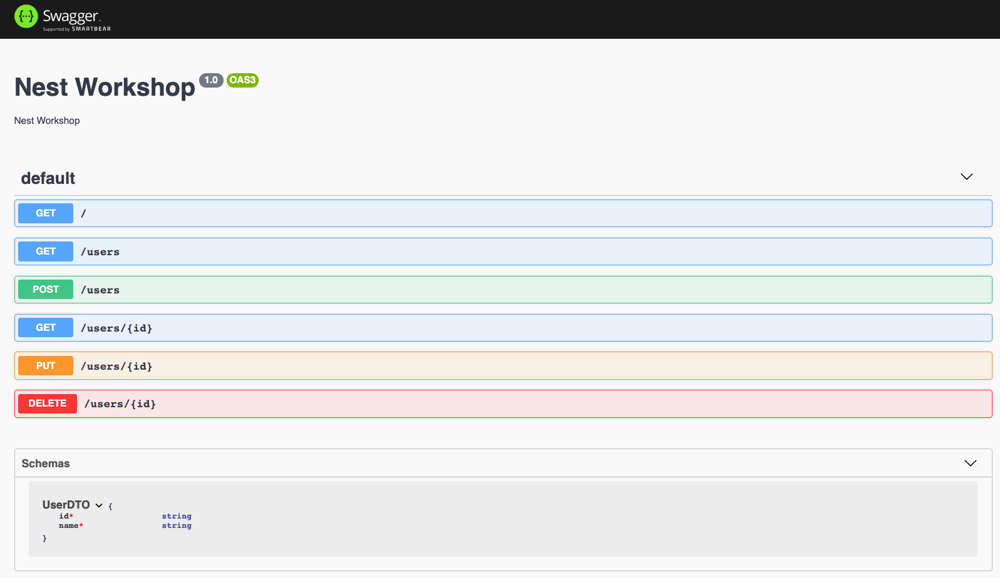

[Código del tutorial: https://github.com/raguilera82/nestjs-workshop](https://github.com/raguilera82/nestjs-workshop)


[TOC]


Vamos a ir explicando los conceptos básicos de NestJS a través de la creación de un API REST para un CRUD de usuarios, la cual implementaremos en capas desacopladas que nos permitirán utilizar distintas tecnologías como Express en la parte del controlador; y Mongo u otra base de datos relacional, como PostgreSQL, en la parte de repositorio de datos.

Partimos de que ya tenemos creado un proyecto con el CLI de NestJS llamado "rest-crud-users". Como en el caso de Angular el primer concepto que se nos presenta es el de módulo, ya que la aplicación de NestJS es obligatorio que tenga al menos un módulo principal.

La responsabilidad de este módulo principal va a ser la de almacenar la configuración necesaria para la ejecución de la aplicación como el acceso a las variables de entorno, la conexión con la base de datos, etc..., a lo largo del ejercicio iremos añadiendo en este módulo todo lo necesario.

Dada la importancia de la documentación en un API vamos a incorporar Swagger a nuestro proyecto, ejecutando:

```bash
$> npm install --save @nestjs/swagger swagger-ui-express
```

Y realizando la configuración en el fichero main.ts que quedará de esta forma:

```ts
import { NestFactory } from '@nestjs/core';
import { DocumentBuilder, SwaggerModule } from '@nestjs/swagger';
import { AppModule } from './app.module';

async function bootstrap() {
  const app = await NestFactory.create(AppModule);
  const options = new DocumentBuilder()
    .setTitle('Nest Workshop')
    .setDescription('Nest Workshop')
    .setVersion('1.0')
    .build();
  const document = SwaggerModule.createDocument(app, options);
  SwaggerModule.setup('api', app, document);
  await app.listen(3000);
}
bootstrap();
```

De forma que todos los endpoints que generemos en la aplicación quedarán debidamente documentados en la URL: http://localhost:3000/api

A fin de estructurar correctamente el API REST en recursos, vamos a crear un módulo secundario exclusivamente para tratar el recurso "user". Para ello, ejecutamos en la terminal:

```bash
$> npx nest generate module users
```

Con lo que nos crea una carpeta "users" con el fichero users.module.ts y además nos edita el fichero app.module.ts para importar "UsersModule".

Dentro de la carpeta "users" vamos a crear el fichero "user.dto.ts" con la clase que va a modelar el recurso a nivel del controlador, y haciendo uso de los decoradores de Swagger iremos documentando el API.

```ts
import { ApiProperty } from "@nestjs/swagger";

export class UserDTO {
    @ApiProperty()
    readonly id?: string;

    @ApiProperty()
    readonly name: string;

    constructor(id: string, name: string) {
        this.id = id;
        this.name = name;
    }
}
```

> Nota: el id lo establecemos como opcional ya que en la creación no se va a pasar

Ahora dentro de la carpeta "users" vamos a crear el fichero users.controller.ts donde vamos a realizar una primera implementación del CRUD solo en memoria a fin de ir definiendo los métodos del controlador y tener rápidamente una primera implementación que de servicio.

```ts
import { Body, Controller, Delete, Get, Param, Post, Put } from '@nestjs/common';
import { UserDTO } from './user.dto';

@Controller('users')
export class UsersController {

    users: UserDTO[] = [];

    @Get()
    getAllUsers(): UserDTO[] {
        return this.users;
    }

    @Get(':id')
    getUserById(@Param('id') id: string): UserDTO {
        const user = this.users.find(user => user.id == id);
        return user;
    }

    @Post()
    newUser(@Body() user: UserDTO): UserDTO {
        const newUser = {...user, id: ''+(this.users.length)}
        this.users = [...this.users, newUser];
        return newUser;
    }

    @Put(':id')
    updateUser(@Param('id') id: string, @Body() user: UserDTO): UserDTO {
        this.users = this.users.filter(user => user.id !== id);
        this.users = [...this.users, this.newUser(user)];
        return user;
    }

    @Delete(':id')
    deleteUser(@Param('id') id: string) {
        this.users = this.users.filter(user => user.id !== id);
    }

}
```

Es importante que esta clase sea referenciada dentro del fichero users.module.ts de esta forma:

```ts
import { Module } from '@nestjs/common';
import { UsersController } from './users.controller';

@Module({
  imports: [],
  controllers: [UsersController],
  providers: []
})
export class UsersModule {}
```

Y vamos a implementar el test e2e asociado que se va a encargar de validar el API como si de un cliente se tratará, en este caso estamos interesados en validar todo el flujo de las operaciones.

 ```ts
import { INestApplication } from '@nestjs/common';
import { Test, TestingModule } from '@nestjs/testing';
import { UserDTO } from 'src/users/user.dto';
import * as request from 'supertest';
import { AppModule } from '../src/app.module';
import { UsersModule } from '../src/users/users.module';

describe('UsersController (e2e)', () => {
  let app: INestApplication;

  beforeEach(async () => {
    const moduleFixture: TestingModule = await Test.createTestingModule({
      imports: [AppModule, UsersModule],
    }).compile();

    app = moduleFixture.createNestApplication();
    await app.init();
  });

  it('users CRUD', async () => {

    const server = request(app.getHttpServer());

    const currentGetAllRequest = await server.get('/users').expect(200);
    const currentSize = currentGetAllRequest.body.length;

    const newUser: UserDTO = {
      name: 'Mateo'
    }
    const newUserRequest = await server.post('/users').type('form')
    .send(newUser).expect(201);
    expect(newUserRequest.body.name).toBe(newUser.name);
    expect(newUserRequest.body.id).toBe(''+(currentSize));
    const postNewRequest = await server.get('/users').expect(200);
    const postNewSize = postNewRequest.body.length;
    expect(postNewSize).toBe(currentSize + 1);

    const id = newUserRequest.body.id;
    const getUserByIdRequest = await server.get(`/users/${id}`).expect(200);
    expect(getUserByIdRequest.body.id).toBe(id);

    const updateUser: UserDTO = {
      id: newUserRequest.body.id,
      name: 'Mateo Aguilera'
    }
    const updateUserRequest = await server.put(`/users/${updateUser.id}`)
    .expect(200).type('form').send(updateUser);
    expect(updateUserRequest.body.name).toEqual(updateUser.name);

    await server.delete(`/users/${updateUser.id}`)
    .expect(200);
    const postDeleteGetAllRequest = await server.get('/users')
    .expect(200);
    const postDeleteSize = postDeleteGetAllRequest.body.length;
    expect(postDeleteSize).toBe(currentSize);

  });
});

 ```

Si volvemos a ver la documentación del API en la URL http://localhost:3000/api veremos algo como esto:



En estos momentos tenemos nuestra aplicación preparada para recibir peticiones y perfectamente documentada, aunque todavía nos falta algún paso para que sea productiva; pero ya tenemos un test base que nos avisará si nos equivocamos durante la implementación real.

### Utilizando PostgreSQL

En estos momentos tenemos nuestra aplicación funcionando en memoria pero ahora queremos que los datos realmente persistan en una base de datos PostgreSQL.

Antes tenemos que tener una instancia de PostgreSQL corriendo en local, y para ello nos vamos a apoyar en docker-compose creando en el raíz del proyecto un fichero docker-compose.yml con la siguiente configuración.

```yaml
version: '3.1'

services:

  psql-db:
    image: postgres:12.1-alpine
    ports:
      - ${POSTGRES_PORT_EXTERNAL}:5432
    environment:
      - POSTGRES_USER=${DB_USER}
      - POSTGRES_PASSWORD=${DB_PASS}
      - POSTGRES_DB=${DB_NAME}
    volumes:
      - psql-db-data:/var/lib/postgresql/data
    networks:
      - ws-network

volumes:
  psql-db-data:

networks:
  ws-network:
```

Como vimos al comienzo del capítulo, las variables de entorno necesarias las establecemos en el fichero .env:

```
POSTGRES_PORT_EXTERNAL=5431
DB_USER=nest
DB_PASS=nest
DB_NAME=nest

DB_HOST=localhost
DB_PORT=5431
DB_SYNC=true
```

> Nota: DB_HOST y DB_PORT se van a utilizar dentro de la aplicación para conectar con la base de datos. DB_HOST apunta a localhost y DB_PORT siempre tiene que apuntar al mismo puerto que POSTGRES_PORT_EXTERNAL. Con DB_SYNC decimos si el esquema se tiene que sincronizar con la base de datos, algo que solo será recomendable en tiempo de desarrollo.

Y levantamos el servicio con el comando:

```bash
$> docker-compose up -d
```

De esta forma ya tenemos una instancia de PostgreSQL con la que poder conectar la aplicación. Para trabajar con bases de datos relacionales, vamo a utilizar la integración con TypeORM (https://typeorm.io/) que NestJS nos proporciona simplemente ejecutando el siguiente comando:

```bash
$> npm install --save @nestjs/typeorm typeorm pg
```

Esta sería la correspondencia de dependencias para otras base de datos:

| Base de datos            | Dependencia |
| ------------------------ | ----------- |
| MySQL                    | mysql       |
| PostgreSQL o CockroachDB | pg          |
| SQLite                   | sqlite3     |
| Microsoft SQL Server     | mssql       |
| sql.js                   | sql.js      |
| Oracle                   | oracledb    |

Ahora tenemos que hacer la conexión con la base de datos en el módulo principal de esta forma:

```ts
import { TypeOrmModule } from '@nestjs/typeorm';
import { UsersModule } from './users/users.module';

@Module({
  imports: [
    ConfigModule.forRoot(), 
    TypeOrmModule.forRoot({
      type: 'postgres',
      host: process.env.DB_HOST,
      port: parseInt(process.env.DB_PORT),
      username: process.env.DB_USER,
      password: process.env.DB_PASS,
      database: process.env.DB_NAME,
      autoLoadEntities: true,
      synchronize: !!process.env.DB_SYNC
    }),
    UsersModule
  ],
  controllers: [],
  providers: [],
})
export class AppModule {}
```

Donde como ves hacemos uso de las variables de entorno especificadas en el fichero .env

Ahora creamos el repositorio para manejar los datos con PostgreSQL, pero antes necesitamos definir la entidad que represente la tabla "users" en base de datos, y un método encargado de su creación a partir del DTO asociado. Para ello creamos el fichero users/users.entity.ts con el siguiente contenido:

```ts
import { Column, Entity, PrimaryGeneratedColumn } from "typeorm";

@Entity('users')
export class UserEntity {

    @PrimaryGeneratedColumn("uuid")
    readonly userId: string;

    @Column({
        unique: true
    })
    readonly name: string;

    constructor(userId: string, name: string) {
        this.userId = userId;
        this.name = name;
        console.log('Creo User Entity para ' + this.name);
    }

}

```

Donde definimos la propiedad "userId" como clave primaria generada como "uuid" y la columna "name" para almacenar el nombre del usuario y lo marcamos con "unique" para que no se pueda repetir.

Todas las opciones de configuración se pueden encontrar en la documentación oficial de [TypeORM](https://typeorm.io/)

Vamos a crear un fichero users/users.mapper.ts que se va encargar de hacer la conversión de dto a entidad y viceversa.

```ts
import { Injectable } from "@nestjs/common";
import { UserDTO } from "./user.dto";
import { UserEntity } from "./user.entity";

@Injectable()
export class UserMapper {

    dtoToEntity(userDTO: UserDTO): UserEntity {
        return new UserEntity(userDTO.id, userDTO.name);
    }

    entityToDto(userEntity: UserEntity): UserDTO {
        return new UserDTO(userEntity.userId, userEntity.name);
    }

}

```
Este servicio tenemos que declararlo como provider dentro del fichero users.module.ts quedando de esta forma:

```ts
import { Module } from '@nestjs/common';
import { TypeOrmModule } from '@nestjs/typeorm';
import { UserEntity } from './user.entity';
import { UserMapper } from './user.mapper';
import { UsersController } from './users.controller';

@Module({
  imports: [TypeOrmModule.forFeature([UserEntity])],
  controllers: [UsersController],
  providers: [UserMapper]
})
export class UsersModule {}

```

Ahora generamos el repositorio que va a manejar esta entidad "UserEntity", para ello creamos el fichero users/users.repository.ts donde hacemos la implementación de los métodos contra la base de datos utilizando el repositorio que nos proporciona TypeORM. Quedando el código de esta forma:

```ts
import { Injectable } from '@nestjs/common';
import { InjectRepository } from '@nestjs/typeorm';
import { DeleteResult, Repository } from 'typeorm';
import { UserDTO } from './user.dto';
import { UserEntity } from './user.entity';
import { UserMapper } from './user.mapper';

@Injectable()
export class UsersRepository {

    constructor(
        @InjectRepository(UserEntity) 
              private usersRepository: Repository<UserEntity>,
        private mapper: UserMapper){}

    getAllUsers(): Promise<UserEntity[]> {
        return this.usersRepository.find();
    }

    getUserById(id: string): Promise<UserEntity> {
        return this.usersRepository.findOne(id);
    }

    newUser(userDTO: UserDTO): Promise<UserEntity> {
        const newUser = this.mapper.dtoToEntity(userDTO);
        return this.usersRepository.save(newUser);
    }

    async updateUser(id: string, userDTO: UserDTO): Promise<UserEntity> {
        userDTO.id = id;
        const updateUser = this.mapper.dtoToEntity(userDTO);
        await this.usersRepository.update(id, updateUser);
        return this.usersRepository.findOne(id);

    }

    deleteUser(id: string): Promise<DeleteResult> {
       return this.usersRepository.delete(id);
    }

}

```

Es importante que el repositorio lo declaremos como provider dentro del fichero users.module.ts y que establezcamos la entidad dentro de TypeORM, quedando de esta forma:

```ts
import { Module } from '@nestjs/common';
import { TypeOrmModule } from '@nestjs/typeorm';
import { UserEntity } from './user.entity';
import { UserMapper } from './user.mapper';
import { UsersController } from './users.controller';
import { UsersRepository } from './users.repository';

@Module({
  imports: [TypeOrmModule.forFeature([UserEntity])],
  controllers: [UsersController],
  providers: [UserMapper, UsersRepository]
})
export class UsersModule {}

```

En este punto seguimos con la implementación del controlador en memoria por lo que el tests e2e sigue pasando, pero ahora tenemos que hacer una refactorización para enganchar el controlador con el repositorio. La mejor forma de hacer esto es con un servicio de negocio intermedio a fin de que la responsabilidad de la lógica de negocio no recaiga ni en el controlador ni en el repositorio.

Para ello creamos el fichero users.service.ts el cual va a inyectar el provider UsersRepository para recuperar y almacenar la información de la entidad y devolver al controlador el dto. El fichero quedaría de esta forma:

```ts
import { Injectable } from '@nestjs/common';
import { UserDTO } from './user.dto';
import { UserEntity } from './user.entity';
import { UserMapper } from './user.mapper';
import { UsersRepository } from './users.repository';

@Injectable()
export class UsersService {

    constructor(
        private usersRepository: UsersRepository,
        private mapper: UserMapper
        ){}

    async getAllUsers(): Promise<UserDTO[]> {
        const users: UserEntity[] = await this.usersRepository.getAllUsers()
        return users.map(user => this.mapper.entityToDto(user));
    }

    async getUserById(id: string): Promise<UserDTO> {
        const user: UserEntity = await this.usersRepository.getUserById(id);
        return this.mapper.entityToDto(user);
    }

    async newUser(userDTO: UserDTO): Promise<UserDTO> {
        const newUser: UserEntity = await this.usersRepository.newUser(userDTO);
        return this.mapper.entityToDto(newUser);
    }

    async updateUser(id: string, userDTO: UserDTO): Promise<UserDTO> {
        const updateUser = await this.usersRepository.updateUser(id, userDTO);
        return this.mapper.entityToDto(updateUser);
    }

    async deleteUser(id: string): Promise<void> {
        await this.usersRepository.deleteUser(id);
    }

}

```

Tenemos que editar el fichero users.module.ts para añadir el provider del servicio anterior, quedando de esta forma:

```ts
import { Module } from '@nestjs/common';
import { TypeOrmModule } from '@nestjs/typeorm';
import { UserEntity } from './user.entity';
import { UserMapper } from './user.mapper';
import { UsersController } from './users.controller';
import { UsersRepository } from './users.repository';
import { UsersService } from './users.service';

@Module({
  imports: [TypeOrmModule.forFeature([UserEntity])],
  controllers: [UsersController],
  providers: [UsersService, UsersRepository, UserMapper]
})
export class UsersModule {}
```

De forma que solo restaría inyectar el servicio de negocio en el controlador para que su única responsabilidad sea la de manejar los datos que llegan en la petición y llamar al servicio de negocio correspondiente; siendo el resultado final:

```ts
import { Body, Controller, Delete, Get, Param, Post, Put } from '@nestjs/common';
import { UserDTO } from './user.dto';
import { UsersService } from './users.service';

@Controller('users')
export class UsersController {

    constructor(private usersService: UsersService){}

    @Get()
    async getAllUsers(): Promise<UserDTO[]> {
        return await this.usersService.getAllUsers();
    }

    @Get(':id')
    async getUserById(@Param('id') id: string): Promise<UserDTO> {
        return await this.usersService.getUserById(id);
    }

    @Post()
    async newUser(@Body() user: UserDTO): Promise<UserDTO> {
        return await this.usersService.newUser(user);
    }

    @Put(':id')
    async updateUser(@Param('id') id: string, @Body() user: UserDTO): Promise<UserDTO> {
        return await this.usersService.updateUser(id, user);
    }

    @Delete(':id')
    async deleteUser(@Param('id') id: string): Promise<void> {
        return await this.usersService.deleteUser(id);
    }

}


```
Todo lo que hemos implementado hasta el momento es pura infraestructura sin ningún tipo de lógica de negocio, por lo que es normal que no tengamos ningún tests unitario asociado.

Lo que sí mantenemos es el tests de integración que implementamos con el controlador en memoria, y que nos sirve como prueba de que todo sigue funcionando pero ya con la base de datos integrada.

Para ello el proyecto cuenta con una tarea personalizada llamada "verify" que se encarga de levantar la base de datos dockerizada, verificar el lint del código, lanzar los tests unitarios, lanzar los tests e2e y calcular el conjunto de cobertura alcanzada.

```bash
$> npm run verify
```

En este punto podemos comprobar que el test e2e sigue pasando y el porcentaje de cobertura es del 100%.

### Gestión de errores

Otro punto crítico de cualquier API es la gestión de los errores. Aquí NestJS también nos facilita el trabajo ya que tiene un manejador de errores global, por lo que cualquier error no conocido lo tratará como un error 500, devolviéndolo de esta forma:

```js
{
    "statusCode": 500,
    "message": "Internal server error"
}
```

Pero realmente lo "mágico" de NestJS es que nos permite definir nuestros propios manejadores de error, evitando que tengamos que llenar nuestro código de try / catch infinitos.

Un caso práctico sería en el ejemplo anterior cuando intentamos añadir un usuario que ya está dado de alta en la base de datos, cuando se da ese caso, NestJS nos devuelve un error 500 y nos pinta este error en la consola del servidor:

```
[Nest] 69939   - 14/05/2020, 14:27:55   [ExceptionsHandler] duplicate key value violates unique constraint "UQ_51b8b26ac168fbe7d6f5653e6cf" +6580ms
QueryFailedError: duplicate key value violates unique constraint "UQ_51b8b26ac168fbe7d6f5653e6cf"
```

Realmente el error que ha dado lo ha lanzado TypeORM y es de tipo QueryFailedError, para devolver un mensaje más significativo a los clientes del API, tenemos que implementar un filter, de forma que en nuestro proyecto creamos una carpeta "filters" y dentro un fichero al que vamos a llamar typeorm-exceptions.filter.ts con el siguiente contenido:

```ts
import { ArgumentsHost, Catch, ExceptionFilter, HttpStatus } from '@nestjs/common';
import { QueryFailedError } from 'typeorm';

@Catch(QueryFailedError)
export class TypeORMExceptionFilter implements ExceptionFilter {
  catch(exception: QueryFailedError, host: ArgumentsHost) {
    const context = host.switchToHttp();
    const response = context.getResponse();
    const request = context.getRequest();
    const { url } = request;
    const { name } = exception;
    const errorResponse = {
      path: url,
      timestamp: new Date().toISOString(),
      message: name,
    };

    response.status(HttpStatus.BAD_REQUEST).json(errorResponse);
  }
}
```

Cuando en nuestro proyecto ocurra un error de tipo "QueryFailedError" este filtro lo capturará y devolverá al cliente un error de tipo "BAD_REQUEST" (400) con el detalle que queramos transmitir de lo ocurrido.

Los filtros los podemos aplicar de forma individual a los endpoints que necesitemos con el decorador @UseFilters(new TypeORMExceptionFilter()) o también de forma global a todos los endpoints declarándolo en el fichero main.ts de esta forma:

```ts
async function bootstrap() {
  const app = await NestFactory.create(AppModule);
  app.useGlobalFilters(new TypeORMExceptionFilter());
  await app.listen(3000);
}
bootstrap();
```

Para probar de forma efectiva este filtro recurrimos a los tests e2e donde tenemos que declarar el filtro dentro de la sección beforeEach donde inicializamos la aplicación.

```ts
beforeEach(async () => {
    const moduleFixture: TestingModule = await Test.createTestingModule({
      imports: [AppModule, UsersModule],
    }).compile();
    app = moduleFixture.createNestApplication();
    app.useGlobalFilters(new TypeORMExceptionFilter());
    await app.init();
  });
```

Y forzar en el flujo del test una situación donde se produzca ese error, que sería intentando añadir un nuevo usuario cuyo "name" ya existe en base de datos.

```ts
const newUser: UserDTO = {
      name: 'Mateo'
    }
const newUserRequest = await server.post('/users').type('form')
.send(newUser).expect(201);
expect(newUserRequest.body.name).toEqual(newUser.name);

await server.post('/users').type('form')
.send(newUser).expect(400);
```

Ahora sí volvemos a ejecutar el comando verify veremos que seguimos manteniendo un 100% de cobertura, que los tests pasan correctamente y que tenemos una aplicación lista para subir a producción.

