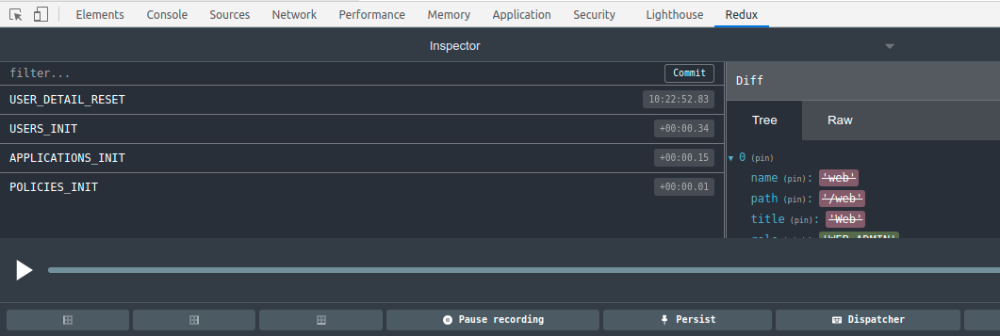

## Resumen

En este tutorial vamos a ver cómo integrar nuestra solución de gestión de estado con las DevTools del navegador para poder depurar nuestras aplicaciones de la forma más cómoda.

## Entorno

* Slimbook Prox15 32 Gb RAM i7
* SlimbookOS (Ubuntu 20.04)
* RxJS 6.6.2
* Visual Studio Code

## Introducción

Seguro que a poco que hayas visto algo de Redux y todas sus variantes en los frameworks de turno, te habrá llamado la atención su integración con las DevTools de Chrome donde se puede ver en todo momento una foto del estado, las acciones que se han producido y "viajar" entre ellas.

Así que vamos a ver cómo conseguir esto sin recurrir a ninguna librería, solo nuestro proyecto de gestión de estado con RxJS.

## Vamos al lío

Lo primero que vamos a hacer es instalar la siguiente extensión de Chrome que nos añadirá una nueva pestaña llamada "Redux" en las Developer Tools. Esto es tan sencillo como ir a la [URL](https://chrome.google.com/webstore/detail/redux-devtools/lmhkpmbekcpmknklioeibfkpmmfibljd?hl=es) y pulsar en instalar.

Ahora tenemos que hacer alguna modificación en nuestro proyecto para habilitar la conexión a esta extensión y mandar la información. Para habilitar la conexión, vamos a ir a nuestro fichero raíz y vamos a incluir lo siguiente:

```ts
const win = window as any;

if (win.__REDUX_DEVTOOLS_EXTENSION__) {
  win.devTools = win.__REDUX_DEVTOOLS_EXTENSION__.connect();
}
```

En mi caso estoy en un proyecto con TypeScript de ahí que tenga que wrappear el window del navegador.

Para evitar que la aplicación falle en el arranque si previamente no hemos instalado la extensión, vamos a poner un if de guarda a la sentencia que nos permite conectar con la extensión.

Ahora tenemos que ver de qué forma le transmitimos los datos a la extensión, es decir, le informamos a la extensión de las acciones y los cambios de estado que se producen.

Esto lo vamos a hacer en el fichero store.ts que implementamos en los anteriores tutoriales de esta serie. De forma que ahora el store va a recibir el tipo de acción y el estado resultante de aplicar dicha acción, quedando de esta forma:

```ts
import { BehaviorSubject, Observable } from 'rxjs';

const win = window as any;

export abstract class Store<T> {
    private state$: BehaviorSubject<T> = new BehaviorSubject(undefined);
    get = (): T => this.state$.getValue();
    get$ = (): Observable<T> => this.state$.asObservable();
    store = (type: string, nextState: T) => {
        if (win.devTools) {
            win.devTools.send(type, nextState);
        }
        return this.state$.next(nextState);
    }
}
```

Como ves también es conveniente verificar que existe el objeto win.devTool antes de utilizarlo, de otra forma nos daría error, al no estar instalada la extensión.

Esto nos obliga a cambiar la implementación de los métodos del store, ya que ahora es obligatorio pasarle el nombre de la acción antes del store modificado. Como por ejemplo:

```ts
export class ApplicationsStoreService extends Store<Application[]> {

  constructor(private service: ApplicationsService) {
    super();
  }

  init(): Promise<Application[]> {
    if (this.get()) { return; }
    return this.service.getApplications().pipe(
      tap((data) => this.store('APPLICATIONS_INIT', data))
    ).toPromise();
  }
}
```

Este será el nombre que veremos en la extensión de Redux cuando nuestra aplicación ejecuta la acción, como vemos en la siguiente imagen.



## Conclusiones

Como ves podemos implementar una solución más sencilla y sobre todo universal, sin perder las ventajas de otras tecnologías más complejas (y completas) como NgRx, Vuex, etc...

Notarás que la extensión muestra los cambios de estado por aplicación como si solo hubiese un store, esto es porque Redux funciona solo con un store. En nuestro caso creamos múltiples stores por lo que realmente la extensión solo nos vale para saber las acciones que se han ejecutado y el orden de ejecución.

La ventaja es que no trabajamos con reducers y nos ahorramos la típica estructura switch con todas las acciones y su lógica asociada.
