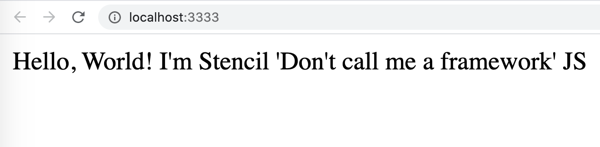
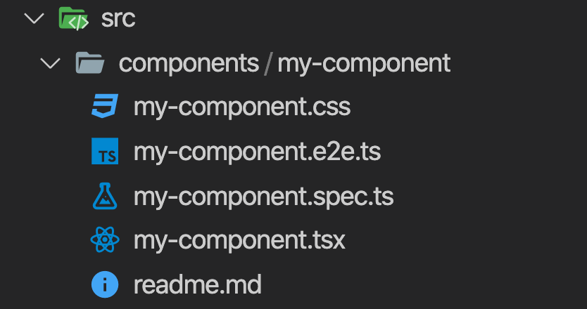

StencilJS es un compilador que genera Web Components nativos 100% compatibles con el estándar y que por tanto lo hacen 100% compatibles con cualquier librería y framework web sin necesidad de ejecutarse en un contexto determinado.

Esta tecnología juega en la liga de las tecnologías de web components reutilizables soportando TypeScript de serie y teniendo un gran rendimiento ya que hace uso del virtual DOM de React y de "lazy loading" por defecto de forma transparente al desarrollo.

De hecho verás que la sintaxis es una mezcla entre Angular y React, aunque también es compatible con Vue, Backbone, o cualquier tecnología web en la que te quieras apoyar.

Detrás de esta tecnología están las personas que desarrollan Ionic y es la tecnología que les ha permitido desde la versión 4 (actualmente está la 5) desmarcarse de Angular y poder ser utilizado en cualquier otra tecnología como Vue y React.

# Empezando con StencilJS

Un buen punto de partida para empezar con esta tecnología es la propia documentación oficial que podemos encontrar [aquí](https://stenciljs.com/docs/getting-started) 

Los desarrolladores de StencilJS nos ofrecen una forma muy rápida de montar el entorno, siempre y cuando tengamos una versión de NPM superior a la 6. Solo tenemos que ejecutar:

```sh
$> npm init stencil
```

Seleccionar el tipo de proyecto entre: ionic-pwa, app y component. Vamos a seleccionar component para la creación de una librería de componentes.

Nos solicita un nombre del proyecto, por ejemplo, my-lib

Y la confirmación, le decimos que Yes.

Con esto tenemos el proyecto listo para ejecutar con código de ejemplo. 

# Investigando el proyecto

Lo primero que llama la atención es ver lo sencillo que queda el package.json  

```javascript
{
  "name": "my-lib",
  "version": "0.0.1",
  "description": "Stencil Component Starter",
  "main": "dist/index.js",
  "module": "dist/index.mjs",
  "es2015": "dist/esm/index.mjs",
  "es2017": "dist/esm/index.mjs",
  "types": "dist/types/index.d.ts",
  "collection": "dist/collection/collection-manifest.json",
  "collection:main": "dist/collection/index.js",
  "unpkg": "dist/poccc/poccc.js",
  "files": [
    "dist/",
    "loader/"
  ],
  "scripts": {
    "build": "stencil build --docs",
    "start": "stencil build --dev --watch --serve",
    "test": "stencil test --spec --e2e",
    "test.watch": "stencil test --spec --e2e --watchAll",
    "generate": "stencil generate"
  },
  "devDependencies": {
    "@stencil/core": "^1.12.2"
  },
  "license": "MIT"
}
```
Fíjate que solo tenemos una dependencia y es de desarrollo. Además ya está todo correctamente configurado para poder ser publicado como librería npm en cualquier repositorio ya sea público o corporativo.

En este fichero podemos ver los scripts que podemos ejecutar.

Otro punto fuerte de la tecnología es que ya te proporciona facilidades para tener una bateria de tests unitarios y E2E que poder ejecutar con Jest.

Para ejecutar los que vienen por defecto solo tenemos que ejecutar en el terminal:

```bash
$> npm run test
```
> Es posible que la primera vez que ejecutamos el comando te de un error por consola. Simplemente vulve a lanzar el comando y listo. No volverá a pasar.

Con este comando verás que primero instala las dependencias que le hace falta de forma dinámica y luego ejecuta los tests.

Ahora vamos a arrancar el proyecto con el comando:

```bash
$> npm run start
```
En pocos segundos se abre el navegador ofreciendo la visualización del componente por defecto que viene en la instalación, el cual es invocado desde el fichero index.html



El componente que ves renderizado por pantalla está dentro de la carpeta src/components, y es en esta carpeta donde tienen que estar todos los componentes de nuestra librería.

# Estructura de un componente

Aquí vemos la estructura de ficheros que nos crea por componente:



* **my-components.css**: es el fichero donde va residir el estilo del componente.
* **my-component.e2e.ts**: es el fichero que implementa el test E2E del componente.
* **my-component.spec.ts**: es el fichero que implementa el test unitario del componente.
* **my-component.tsx**: es el fichero que contiene la lógica del componente y la presentación HTML.
* **readme.md**: otro de los puntos fuertes de esta tecnología es que este fichero readme.md se genera de forma automática en base a las características del componente, el cual usaremos para documentar el componente.

# Detalles de sintaxis

Si vemos el contenido del fichero my-component.tsx podemos apreciar algunas de las características de la sintaxis de un componente con StencilJS

```typescript
import { Component, Prop, h } from '@stencil/core';
import { format } from '../../utils/utils';

@Component({
  tag: 'my-component',
  styleUrl: 'my-component.css',
  shadow: true
})
export class MyComponent {
  /**
   * The first name
   */
  @Prop() first: string;

  /**
   * The middle name
   */
  @Prop() middle: string;

  /**
   * The last name
   */
  @Prop() last: string;

  private getText(): string {
    return format(this.first, this.middle, this.last);
  }

  render() {
    return <div>Hello, World! I'm {this.getText()}</div>;
  }
}
```

De primeras parece un componente Angular donde vemos el uso de @Component pero con otras propiedades. También el @Prop recuerda mucho al @Input de Angular.

Pero luego nos fijamos en el método render() el cual expone el contenido HTML del componente con una sintaxis mucho más parecida a React.

# Creación de componentes

Para la creación de componentes StencilJS nos proporciona el script "generate" por lo que crear un nuevo componente es tan sencillo como ejecutar:

```bash
$> npm run generate nombre-componente
```

# Elementos del API

Otro de los puntos fuertes de la tecnología es que presenta un API muy sencilla a base de decoradores:

* **@Component()**: Para declarar un componente

* **@Prop()**: Para obtener el valor de una propiedad

* **@Watch()**: Para detectar cambios en una propiedad

* **@State()**: Para definir un estado y renderizar cuando se modifique

* **@Method()**: Para exponer un método del elemento al exterior

* **@Element()**: Para obtener referencia al elemento en el DOM

* **@Event()**: Para emitir eventos personalizados al DOM

* **@Listen()**: Para escuchar eventos del DOM

# Métodos del ciclo de vida

Al igual que ocurre con otras tecnologías, StencilJS define una serie de métodos que nos permiten ejecutar código dentro de una determinada fase del ciclo de vida del componente. Se definen:

* **componentWillLoad()**: el componente se acaba de cargar pero todavía no se ha renderizado. Es el mejor sitio para hacer actualizaciones de datos antes de la primera renderización del componente. Solo se llama una vez, sería similar al ngOnInit de Angular.

* **componentDidLoad()**: el componente se ha cargado y renderizado. Cualquier cambio de datos en este método hace que se vuelva a renderizar el componente. Solo se va a ejecutar una vez.

* **componentWillUpdate()**: el componente, ya cargado y renderizado, se acaba de actualizar y volver a renderizar. Se va a llamar múltiples veces a lo largo del ciclo de vida cuando se detecte un cambio; no se va a llamar en el primer renderizado.

* **componentDidUpdate()**: el componente ya se ha actualizado y renderizado con el nuevo valor. Se llama múltiples veces a lo largo del ciclo de vida del componente y no se llama en el primer renderizado.

* **componentDidUnload()**: el componente pierde la referencia y será destruido. Similar al ngOnDestroy de Angular.

