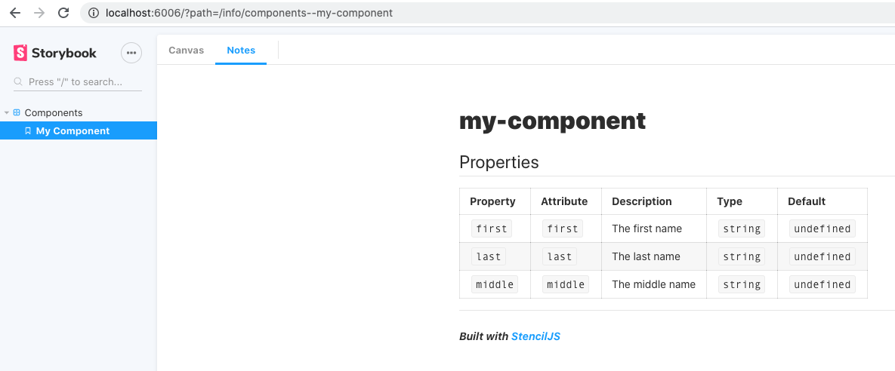

A poco que empieces a crear componentes en el proyecto de StencilJS te darás cuenta que como showcase el fichero index.html se queda muy corto, así que es el momento de integrarlo con Storybook.

Storybook es una herramienta que está especialmente creada para hacer de showcase de componentes y además la podemos integrar con la propia documentación que genera StencilJS de forma automática.

Partiendo de un proyecto de StencilJS recién creado estos son los pasos que tenemos que seguir para la integración de Storybook.

En primer lugar integrar el CLI de Storybook en el proyecto para eso dentro de la raíz del proyecto ejecutamos:

```bash
$> npx -p @storybook/cli sb init --type html 
```

Posteriormente instalamos las dependencias de los addons que vayamos a utilizar de Storybook, entre los que destaco:

- **@storybook/addon-notes**: nos va a permitir mostrar en la propia herramienta la documentación del componente que genera de forma automática StencilJS.
- **@storybook/addon-knobs**: nos permite dinamizar las propiedades de entrada de los componentes pudiendo incluir unos u otros valores para ver el resultado de renderizado.

Por tanto, ejecutamos:

```bash
$> npm install --save-dev @storybook/addon-notes @storybook/addon-knobs
```

Al instalar el CLI nos habrá creado la carpeta main.js en la cual le vamos a indicar donde tiene que buscar los ficheros .stories. que se encargan de visualizar los componentes en Storybook. Lo dejamos con el siguiente contenido, ya que queremos incorporar el fichero stories dentro de la carpeta del componente.

```javascript
module.exports = {
  stories: ['../src/**/*.stories.js'],
  addons: ['@storybook/addon-notes', '@storybook/addon-knobs']
};
```

Para poder cargar los componentes generados con StencilJs en Storybook necesitamos crear el fichero .storybook/preview.js donde vamos a realizar la carga con el siguiente contenido:

```javascript
import { defineCustomElements } from '../dist/esm/loader';

defineCustomElements();
```

Hecho esto vamos eliminar la carpeta stories que nos he creado por defecto el Storybook CLI y vamos a crear nuestra primera story para lo cual creamos el fichero src/components/my-component/my-component.stories.js con el siguiente contenido:

```javascript
import { storiesOf } from '@storybook/html';
import notes from './readme.md';

storiesOf('Components', module)
.add('My Component', () => {
  return `<my-component first="Ruben" middle="Aguilera" last="Diaz-Heredero"></my-component>`
}, {notes})
```

 Ahora para arrancar el proyecto de StencilJS con Storybook y tener "hot reload" necesitamos ejecutar la build de StencilJS con el parámetro --watch 

```bash
$> npm run build -- --watch
```

Lo que hace que se quede esperando cambios en el código para volver a ejecutarse de forma automática; y abriendo un nuevo terminal levantamos Storybook ejecutando:

```bash
$> npm run storybook
```

De esta forma se nos abrirá el navegador mostrando la herramienta Storybook mostrando nuestro componente por defecto


Y si pinchamos en la pestaña "Notes" podemos ver la documentación generada por StencilJs desde el propio Storybook, lo que lo que hace que sea una herramienta ideal como showcase de la librería de componentes.


